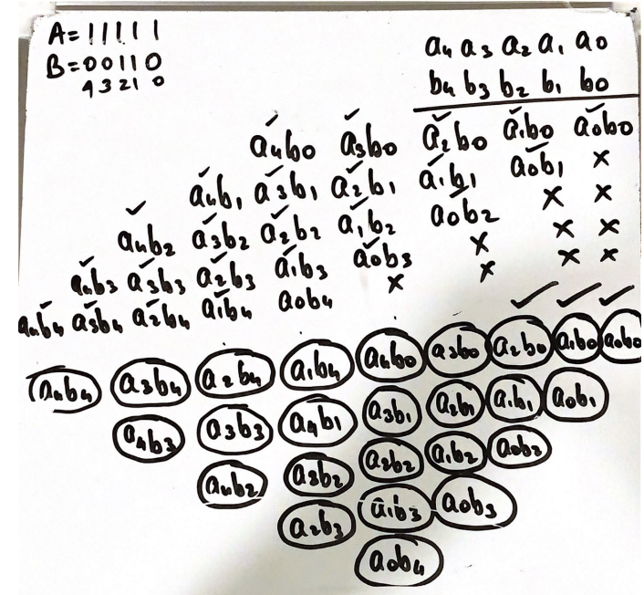

# Wallace-Tree-Multiplier
##5x5 Bits Verilog implementation of the Wallace Tree Multiplier   

Verilog code project of a modular 5bitx5bit Wallace Tree multiplier built using Full and Half Adders.  

"A Wallace multiplier is a hardware implementation of a binary multiplier, a digital circuit that multiplies two integers. It uses a selection of full and half adders (the Wallace tree or Wallace reduction) to sum partial products in stages until two numbers are left. Wallace multipliers reduce as much as possible on each layer. It has **$O(log n)$** reduction layers, but each layer has only **$O(1)$** propagation delay. A naive addition of partial products would require **$O(log^2n)$** time."***-Wikipedia***

